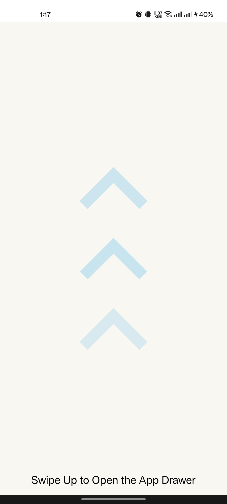
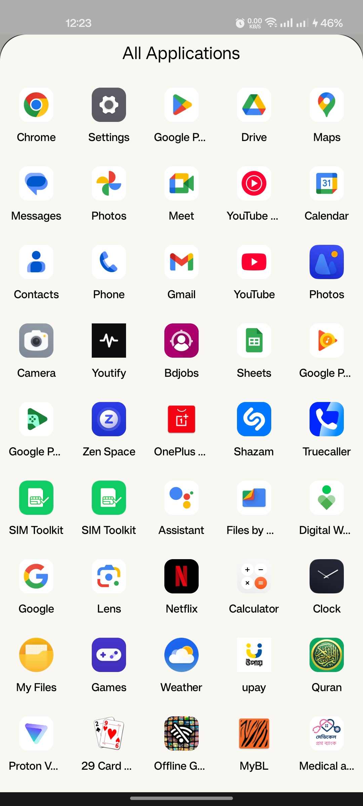

# AppDrawer 

This Android project demonstrates how to display all launchable applications on a device using a `BottomSheetDialogFragment`. When the user swipes up on an activity, a bottom sheet appears, listing all installed apps.

## 📌 Features  
-  **Swipe Up Gesture**: Triggers a `BottomSheetDialogFragment`.  
-  **List Installed Apps**: Dynamically fetches all launchable applications.  
-  **User-Friendly UI**: Displays app icons and names in an elegant bottom sheet.  
-  **Efficient Performance**: Optimized retrieval of installed applications.
-  **Launch Installed App**: launches app on click.

## 🛠️ Tech Stack  
- **Language**: Java  
- **UI Components**: `BottomSheetDialogFragment`, `RecyclerView`  
- **System Services**: `PackageManager`

## 🖼️ Screenshots  
| Swipe Up Gesture | App List Display |
|-----------------|-----------------|
|  |  |

## 🚀 Getting Started  

1️⃣ Clone the repository:  
```sh
git clone https://github.com/yourusername/your-repository.git
```

2️⃣ Open in **Android Studio** and build the project.  

3️⃣ Run the app on an emulator or device. Swipe up to see the app list!  

## 🏗️ How It Works  
- The app fetches installed applications using `PackageManager`.  
- It populates a `RecyclerView` inside a `BottomSheetDialogFragment`.  
- Clicking an app launches it using `Intent.ACTION_MAIN`.  


## 💡 Future Enhancements  
- Add search functionality.  
- Improve animations and UI.  
- Categorize apps by type.


